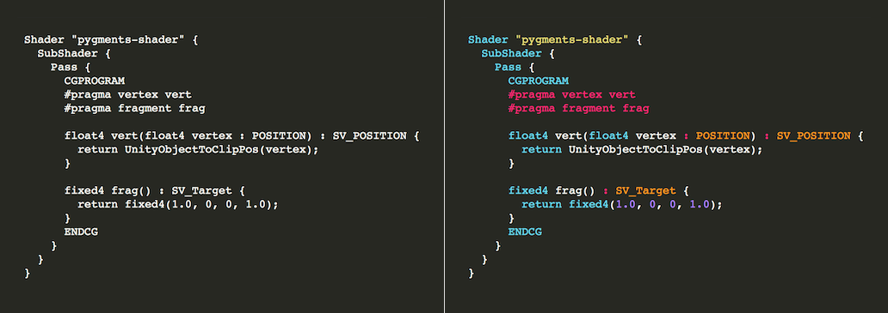

===============
pygments-shader
===============

.. image:: https://travis-ci.org/midnightSuyama/pygments-shader.svg?branch=master
    :target: https://travis-ci.org/midnightSuyama/pygments-shader

.. image:: https://badge.fury.io/py/pygments-shader.svg
    :target: https://badge.fury.io/py/pygments-shader

Pygments lexer for Unity shader

------------
Installation
------------

::

    $ pip install pygments-shader

-----
Usage
-----

::

    $ pygmentize -l shader example.shader
